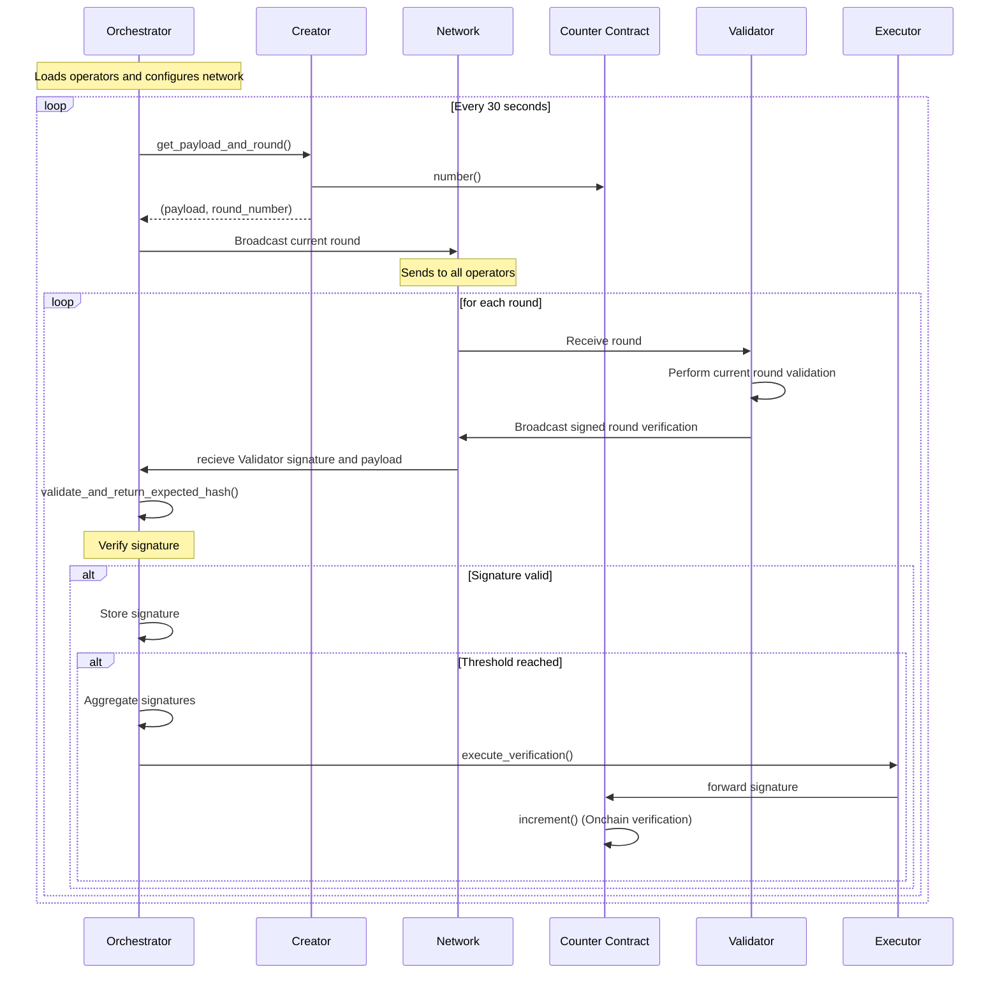

# Commonware AVS Router

This repository implements a BLS signature aggregation protocol with on-chain execution, where multiple operators sign messages that are then aggregated and executed on-chain when a threshold is reached.

## System Architecture

The system consists of several key components that work together to implement the signature aggregation protocol:

### Sequence Diagram



## Key Components

### 1. Orchestrator (`src/handlers/orchestrator.rs`)
- Main coordinator that manages the entire aggregation process
- Maintains list of contributors and their G1/G2 public keys
- listens to network gossip and performs signature collection and aggregation
- Manages the creation of aggregation rounds
- Key methods:
  - `new()`: Initializes with contributors and configuration
  - `run()`: Main loop that manages the aggregation process

### 2. Creator (`src/handlers/creator.rs`)
- Handles  round payload creation and round number management
- Interacts with the counter contract to get current round
- Key methods:
  - `get_payload_and_round()`: Gets current round and encoded payload
  - `encode_number_call()`: Encodes the number for on-chain execution

### 3. Executor (`src/handlers/executor.rs`)
- Handles on-chain execution of increment
- Manages execution env specific interaction with smart contracts and verification metadata
- Maintains a mapping of G1 public keys to operator addresses for efficient lookups
- Interacts with multiple smart contracts:
  - BLSApkRegistry: For operator address lookups
  - BLSSigCheckOperatorStateRetriever: For stake and signature verification
  - Counter: For executing the actual increment operation
- Key methods:
  - `execute_verification()`: Executes the increment on-chain with aggregated signature
    - Takes payload hash, participating G1 keys, participating public keys, and signatures
    - Aggregates signatures and converts to G1 point
    - Retrieves non-signer stakes and signature data (BLS Signature verification metadata conforming to the [BLSSignatureChecker](https://github.com/Layr-Labs/eigenlayer-middleware/blob/dev/src/BLSSignatureChecker.sol))
    - Executes the increment transaction on-chain
  - `ensure_g1_hash_map_entry()`: Maps G1 public keys to operator addresses
    - Caches operator addresses for efficient lookups
    - Converts G1 public keys to operator addresses via BLSApkRegistry
    - Maintains an in-memory mapping to avoid repeated on-chain lookups

### 4. Validator (`src/handlers/validator.rs`)
- Validates round payloads propogated with a signature match the expected round message hash  
- Ensures round numbers match
- Placeholder for protocol / business logic
- Key methods:
  - `validate_and_return_expected_hash()`: Validates message and returns hash
  - `verify_message_round()`: Verifies round number matches current state

### 5. Wire Protocol (`src/handlers/wire.rs`)
- Defines the message format for communication
- Protocol specific round information should be defined here 
- Orchestrator ingress should conform to wire.rs defintions
- Handles serialization/deserialization
- Key message types:

### 6. Configuration (`src/config.rs`)
- Handles reading contract addresses from the AVS deployment JSON file
- Automatically loads contract addresses without manual configuration
- Key methods:
  - `load()`: Loads deployment configuration from JSON file
  - Contract address getters for registry coordinator, BLS APK registry, and counter

## System Flow

1. The Orchestrator initializes with a list of operators and their public keys
2. Every 30 seconds (configurable), it:
   - Gets a new payload and round number from the Creator
   - Broadcasts a Start message to all operators
   - Collects signatures from operators
   - Validates each signature
   - When threshold is reached, aggregates signatures
   - Executes the vote on-chain through the Executor

## Smart Contracts

The system interacts with several smart contracts:
- Counter Contract: Tracks rounds and executes votes
- BLSApkRegistry: Maps public keys to operator addresses
- OperatorStateRetriever: Retrieves operator state and stakes

Contract addresses are automatically read from the `avs_deploy.json` file specified in the `AVS_DEPLOYMENT_PATH` environment variable.

## Environment Variables

The following environment variables are required:
- `HTTP_RPC`: HTTP RPC endpoint
- `WS_RPC`: WebSocket RPC endpoint  
- `AVS_DEPLOYMENT_PATH`: Path to AVS deployment JSON file (contains contract addresses)
- `OPERATOR_STATE_RETRIEVER`: Address of Operator State Retriever contract
- `PRIVATE_KEY`: Private key for signing transactions
- `CONTRIBUTOR_X_KEYFILE`: Path to BLS key files for contributors

**Note**: Contract addresses (COUNTER_ADDRESS, REGISTRY_COORDINATOR_ADDRESS, BLS_APK_REGISTRY_ADDRESS) are now automatically read from the deployment JSON file and no longer need to be set as environment variables.

## Usage

1. Set up the required environment variables
2. Run the orchestrator:
```bash
cargo run -- --key-file <path_to_key_file> --port <port_number>
```

## Dependencies

- alloy: Ethereum interaction
- bn254: BLS signature operations
- commonware_cryptography: Cryptographic operations
- commonware_p2p: P2P networking
- commonware_runtime: Runtime utilities
- eigen_crypto_bls: BLS cryptography
- governor: Rate limiting
- serde: Serialization/deserialization
- serde_json: JSON parsing for configuration
- tracing: Logging

## Set Up Environment 

```sh
git submodule update --init --recursive
cd eigenlayer-bls-local
```
Follow the instructions in the `eigenlayer-bls-local/README.md` to run TESTNET mode 

When the process is finished (You should see `Operator X weight in quorum 0: 11887896997963931 [1.188e16]` where X is the number of test accounts configured) 

```sh
docker compose down 
```

## Set Up Nodes 
```sh
cd ../commonware-avs-node
cargo build 
cp example.env .env 
```

The contract addresses (COUNTER_ADDRESS, REGISTRY_COORDINATOR_ADDRESS, BLS_APK_REGISTRY_ADDRESS) are now automatically read from the `avs_deploy.json` file specified in `AVS_DEPLOYMENT_PATH`. You only need to manually set:

- RPC URLs (`HTTP_RPC`, `WS_RPC`) 
- The path to the deployment file (`AVS_DEPLOYMENT_PATH`)

For `CONTRIBUTOR_X_KEYFILE`, use the `../eigenlayer-bls-local/.nodes/operator_keys/testaccX.bls.key.json` keyfiles.

In 3 different terminals: 

## Contributor 1
```bash
cd commonware-avs-node
source .env
cargo run --release -- --key-file $CONTRIBUTOR_1_KEYFILE --port 3001 --orchestrator orchestrator.json 
```

## Contributor 2
```bash
cd commonware-avs-node
source .env
cargo run --release -- --key-file $CONTRIBUTOR_2_KEYFILE --port 3002 --orchestrator orchestrator.json 

```

## Contributor 3
```bash
cd commonware-avs-node
source .env
cargo run --release -- --key-file $CONTRIBUTOR_3_KEYFILE --port 3003 --orchestrator orchestrator.json 
```
Note that the further in time you get from the deployment, the longer the init for the contributors will take and you may need to init them 1 by 1 in order to not max out rpc limits.

# Run Router 

```sh
cp example.env .env 
```

The contract addresses are automatically read from the `avs_deploy.json` file. You only need to manually configure:

- RPC URLs (`HTTP_RPC`, `WS_RPC`)
- The path to the deployment file (`AVS_DEPLOYMENT_PATH`)

## Orchestrator
```bash
cargo run --release -- --key-file config/orchestrator.json --port 3000
```

# Local Mode Setup 

Local mode allows you to run the entire environment on a local blockchain for development and testing. This is faster and doesn't require testnet gas.

## Prerequisites

- Docker and Docker Compose 
- Rust 
- Git 

## Private Key Funding

The local blockchain environment forks the Holesky testnet and runs locally. This means:

- **Your private key must be funded on Holesky testnet** to execute transactions
- The local environment maintains the same state as the forked Holesky network
- You need Holesky ETH in your account for gas fees and contract interactions
- Test operators are automatically registered and funded during the Docker setup process

To get Holesky testnet ETH for your private key, you can use:
- [Holesky Faucet](https://holesky-faucet.pk910.de/)
- [Ethereum Foundation Holesky Faucet](https://faucet.quicknode.com/ethereum/holesky)

## Step-by-Step Local Mode Setup

### 1. Initialize Submodules and Build Environment

```bash
git submodule update --init --recursive
cd eigenlayer-bls-local
```

### 2. Start Local Blockchain and Deploy Contracts

Configure local mode as per the instructions in the read me for eigenlayer-bls-local and run the local EigenLayer environment with 3 operators:

```bash
docker compose up
```

**Important**: Wait for the deployment to complete. You should see outputs like:
```
Operator 1 weight in quorum 0: 11887896997963931 [1.188e16]
Operator 2 weight in quorum 0: 11887896997963931 [1.188e16]  
Operator 3 weight in quorum 0: 11887896997963931 [1.188e16]
```

This indicates that:
- Local blockchain is running on `localhost:8545`
- All EigenLayer contracts are deployed
- 3 test operators are registered and have joined quorum 0
- Contract addresses are saved to `.nodes/avs_deploy.json`

### 3. Keep Environment Running

Keep the docker containers running in the background. The blockchain will continue running with all deployed contracts and registered operators. You can open new terminal windows for the next steps.

### 4. Configure AVS Router for Local Mode

Navigate back to the router directory and set up configuration:

```bash
cd ../
cp example.env .env
```

Edit your `.env` file to use local mode:

```bash
# Comment out testnet RPC URLs
# HTTP_RPC=https://ethereum-holesky.publicnode.com
# WS_RPC=wss://ethereum-holesky.publicnode.com

# Uncomment local RPC URLs
HTTP_RPC=http://localhost:8545
WS_RPC=ws://localhost:8545

# Set your private key (must be funded - see Private Key Funding section)
PRIVATE_KEY=

# Other settings remain the same
AVS_DEPLOYMENT_PATH="eigenlayer-bls-local/.nodes/avs_deploy.json"
CONTRIBUTOR_1_KEYFILE="eigenlayer-bls-local/.nodes/operator_keys/testacc1.private.bls.key.json"
CONTRIBUTOR_2_KEYFILE="eigenlayer-bls-local/.nodes/operator_keys/testacc2.private.bls.key.json"
CONTRIBUTOR_3_KEYFILE="eigenlayer-bls-local/.nodes/operator_keys/testacc3.private.bls.key.json"
```

### 5. Set Up AVS Nodes

Navigate to the node directory and build:

```bash
cd commonware-avs-node
cargo build
cp example.env .env
```

Configure the node `.env` file for local mode (update RPC URLs to use localhost:8545).

### 6. Start the Contributors

Open 3 separate terminals and run each contributor:

**Terminal 1 - Contributor 1:**
```bash
cd commonware-avs-node
source .env
cargo run --release -- --key-file $CONTRIBUTOR_1_KEYFILE --port 3001 --orchestrator orchestrator.json
```

**Terminal 2 - Contributor 2:**
```bash
cd commonware-avs-node  
source .env
cargo run --release -- --key-file $CONTRIBUTOR_2_KEYFILE --port 3002 --orchestrator orchestrator.json
```

**Terminal 3 - Contributor 3:**
```bash
cd commonware-avs-node
source .env  
cargo run --release -- --key-file $CONTRIBUTOR_3_KEYFILE --port 3003 --orchestrator orchestrator.json
```

### 7. Start the Router Orchestrator

In a 4th terminal, start the main orchestrator:

```bash
cd .. # Back to router root directory
source .env
cargo run --release -- --key-file config/orchestrator.json --port 3000
```

## Ingress Mode Setup

When the `INGRESS` environment variable is set to `true`, the orchestrator will start an HTTP server on port 8080 to accept external task requests. This allows external systems to trigger aggregation rounds via HTTP endpoints.

### Enable Ingress Mode

To enable ingress mode, add the following to your `.env` file:

```bash
INGRESS=true
```

### HTTP Endpoints

When ingress is enabled, the following HTTP endpoint becomes available:

- **POST /trigger**: Accepts task requests to trigger new aggregation rounds
  - Request body: JSON with `body` field containing `var1`, `var2`, and `var3` (all strings)
  - Response: JSON with `success` and `message` fields

### Example Usage

1. Start the orchestrator with ingress enabled:
```bash
source .env
cargo run --release -- --key-file config/orchestrator.json --port 3000
```

2. Send a task request to trigger an aggregation round:
```bash
curl -X POST http://localhost:8080/trigger \
  -H "Content-Type: application/json" \
  -d '{
    "body": {
      "var1": "2024-01-15 14:30:00",
      "var2": "value2_123",
      "var3": "value3_1705327800"
    }
  }'
```

### Ingress Script

You can also use the provided script to trigger tasks automatically:

```bash
cd src/ingress
./trigger_endpoint.sh
```

This script sends task requests to the ingress endpoint every 30 seconds with:
- `var1`: Current timestamp
- `var2`: Value with request counter
- `var3`: Unix timestamp

It will continue running until you stop it with Ctrl+C. The script displays the response status and body for each request.