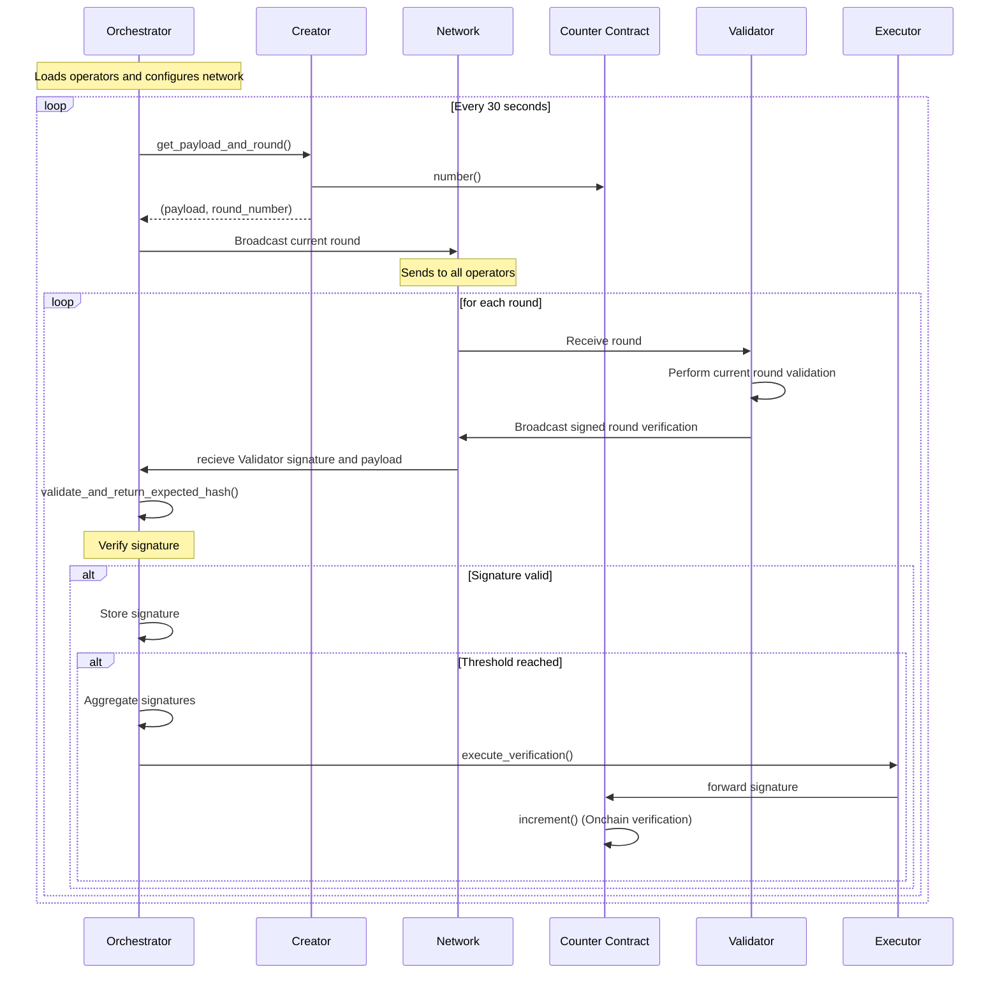

# Commonware AVS Router

This repository implements a BLS signature aggregation protocol with on-chain execution, where multiple operators sign messages that are then aggregated and executed on-chain when a threshold is reached.

## System Architecture

The system consists of several key components that work together to implement the signature aggregation protocol:

### Sequence Diagram



## Key Components

### 1. Orchestrator (`src/handlers/orchestrator.rs`)
- Main coordinator that manages the entire aggregation process
- Maintains list of contributors and their G1/G2 public keys
- listens to network gossip and performs signature collection and aggregation
- Manages the timing of aggregation rounds
- Key methods:
  - `new()`: Initializes with contributors and configuration
  - `run()`: Main loop that manages the aggregation process

### 2. Creator (`src/handlers/creator.rs`)
- Handles  round payload creation and round number management
- Interacts with the counter contract to get current round
- Key methods:
  - `get_payload_and_round()`: Gets current round and encoded payload
  - `encode_number_call()`: Encodes the number for on-chain execution

### 3. Executor (`src/handlers/executor.rs`)
- Handles on-chain execution of increment
- Manages execution env specific interaction with smart contracts and verification metadata
- Maintains a mapping of G1 public keys to operator addresses for efficient lookups
- Interacts with multiple smart contracts:
  - BLSApkRegistry: For operator address lookups
  - BLSSigCheckOperatorStateRetriever: For stake and signature verification
  - Counter: For executing the actual increment operation
- Key methods:
  - `execute_verification()`: Executes the increment on-chain with aggregated signature
    - Takes payload hash, participating G1 keys, participating public keys, and signatures
    - Aggregates signatures and converts to G1 point
    - Retrieves non-signer stakes and signature data (BLS Signature verification metadata conforming to the [BLSSignatureChecker](https://github.com/Layr-Labs/eigenlayer-middleware/blob/dev/src/BLSSignatureChecker.sol))
    - Executes the increment transaction on-chain
  - `ensure_g1_hash_map_entry()`: Maps G1 public keys to operator addresses
    - Caches operator addresses for efficient lookups
    - Converts G1 public keys to operator addresses via BLSApkRegistry
    - Maintains an in-memory mapping to avoid repeated on-chain lookups

### 4. Validator (`src/handlers/validator.rs`)
- Validates round payloads propogated with a signature match the expected round message hash  
- Ensures round numbers match
- Placeholder for protocol / business logic
- Key methods:
  - `validate_and_return_expected_hash()`: Validates message and returns hash
  - `verify_message_round()`: Verifies round number matches current state

### 5. Wire Protocol (`src/handlers/wire.rs`)
- Defines the message format for communication
- Protocol specific round information should be defined here 
- Orchestrator ingress should conform to wire.rs defintions
- Handles serialization/deserialization
- Key message types:

### 6. Configuration (`src/config.rs`)
- Handles reading contract addresses from the AVS deployment JSON file
- Automatically loads contract addresses without manual configuration
- Key methods:
  - `load()`: Loads deployment configuration from JSON file
  - Contract address getters for registry coordinator, BLS APK registry, and counter

## System Flow

1. The Orchestrator initializes with a list of operators and their public keys
2. Every 30 seconds (configurable), it:
   - Gets a new payload and round number from the Creator
   - Broadcasts a Start message to all operators
   - Collects signatures from operators
   - Validates each signature
   - When threshold is reached, aggregates signatures
   - Executes the vote on-chain through the Executor

## Smart Contracts

The system interacts with several smart contracts:
- Counter Contract: Tracks rounds and executes votes
- BLSApkRegistry: Maps public keys to operator addresses
- OperatorStateRetriever: Retrieves operator state and stakes

Contract addresses are automatically read from the `avs_deploy.json` file specified in the `AVS_DEPLOYMENT_PATH` environment variable.

## Environment Variables

The following environment variables are required:
- `HTTP_RPC`: HTTP RPC endpoint
- `WS_RPC`: WebSocket RPC endpoint  
- `AVS_DEPLOYMENT_PATH`: Path to AVS deployment JSON file (contains contract addresses)
- `OPERATOR_STATE_RETRIEVER`: Address of Operator State Retriever contract
- `PRIVATE_KEY`: Private key for signing transactions
- `CONTRIBUTOR_X_KEYFILE`: Path to BLS key files for contributors

**Note**: Contract addresses (COUNTER_ADDRESS, REGISTRY_COORDINATOR_ADDRESS, BLS_APK_REGISTRY_ADDRESS) are now automatically read from the deployment JSON file and no longer need to be set as environment variables.

## Usage

1. Set up the required environment variables
2. Run the orchestrator:
```bash
cargo run -- --key-file <path_to_key_file> --port <port_number>
```

## Dependencies

- alloy: Ethereum interaction
- bn254: BLS signature operations
- commonware_cryptography: Cryptographic operations
- commonware_p2p: P2P networking
- commonware_runtime: Runtime utilities
- eigen_crypto_bls: BLS cryptography
- governor: Rate limiting
- serde: Serialization/deserialization
- serde_json: JSON parsing for configuration
- tracing: Logging

## Set Up Environment 

```sh
git submodule update --init --recursive
cd eigenlayer-bls-local
```
Follow the instructions in the `eigenlayer-bls-local/README.md` to run TESTNET mode 

When the process is finished (You should see `Operator X weight in quorum 0: 11887896997963931 [1.188e16]` where X is the number of test accounts configured) 

```sh
docker compose down 
```

## Set Up Nodes 
```sh
cd ../commonware-avs-node
cargo build 
cp example.env .env 
```

The contract addresses (COUNTER_ADDRESS, REGISTRY_COORDINATOR_ADDRESS, BLS_APK_REGISTRY_ADDRESS) are now automatically read from the `avs_deploy.json` file specified in `AVS_DEPLOYMENT_PATH`. You only need to manually set:

- Your private key (`PRIVATE_KEY`)
- RPC URLs (`HTTP_RPC`, `WS_RPC`) 
- The path to the deployment file (`AVS_DEPLOYMENT_PATH`)

For `CONTRIBUTOR_X_KEYFILE`, use the `../eigenlayer-bls-local/.nodes/operator_keys/testaccX.bls.key.json` keyfiles.

In 3 different terminals: 

## Contributor 1
```bash
cd commonware-avs-node
source .env
cargo run --release -- --key-file $CONTRIBUTOR_1_KEYFILE --port 3001 --orchestrator orchestrator.json 
```

## Contributor 2
```bash
cd commonware-avs-node
source .env
cargo run --release -- --key-file $CONTRIBUTOR_2_KEYFILE --port 3002 --orchestrator orchestrator.json 

```

## Contributor 3
```bash
cd commonware-avs-node
source .env
cargo run --release -- --key-file $CONTRIBUTOR_3_KEYFILE --port 3003 --orchestrator orchestrator.json 
```
Note that the further in time you get from the deployment, the longer the init for the contributors will take and you may need to init them 1 by 1 in order to not max out rpc limits.

# Run Router 

```sh
cp example.env .env 
```

The contract addresses are automatically read from the `avs_deploy.json` file. You only need to manually configure:

- Your private key (`PRIVATE_KEY`)
- RPC URLs (`HTTP_RPC`, `WS_RPC`)
- The path to the deployment file (`AVS_DEPLOYMENT_PATH`)

## Orchestrator
```bash
cargo run --release -- --key-file commonware-avs-node/orchestrator.json --port 3000
```
