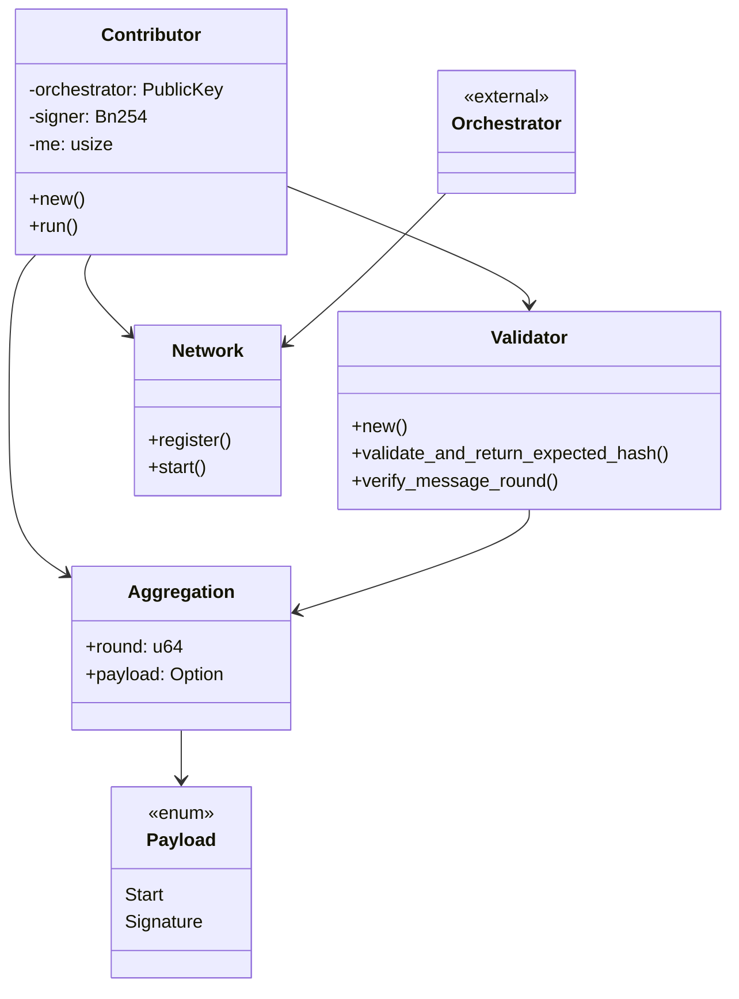
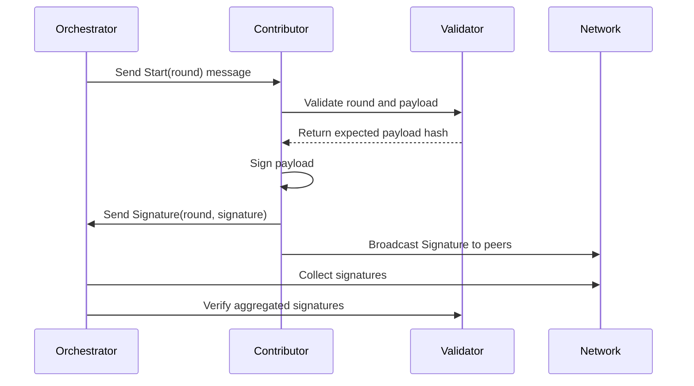

# Commonware AVS Node

Please see [the following repo](https://github.com/BreadchainCoop/commonware-avs-router.git) for context on how to use this repo. 

## Quickstart
```sh
cp .example.env .env 
```

## Running Contributors
```bash
source .env
cargo run --release -- --key-file $CONTRIBUTOR_1_KEYFILE --port 3001 --orchestrator orchestrator.json 

source .env
cargo run --release -- --key-file $CONTRIBUTOR_2_KEYFILE --port 3002 --orchestrator orchestrator.json 

source .env
cargo run --release -- --key-file $CONTRIBUTOR_3_KEYFILE --port 3003 --orchestrator orchestrator.json 
```

---

## Core Functionalities

- **Signature Aggregation**: Aggregates signatures from multiple contributors, supporting threshold signing (e.g., n-of-m).
- **Contributor Node**: Each contributor runs a node, signs payloads, and broadcasts signatures to the orchestrator and peers.
- **Coordinate with Orchestrator**: Coordinates aggregation rounds, initiates signing, and collects signatures.
- **Validator**: Verifies message rounds and payloads, ensuring only valid signatures are accepted.
- **P2P Network**: Authenticated, message-based communication between contributors and orchestrator.
- **Wire Protocol**: Defines message formats for aggregation rounds and signatures.
- **Reference Operator State Retrieval**: Fetches operator states from on-chain contracts for dynamic peer configuration.

---

## Architecture Diagram



---

## Aggregation Workflow


