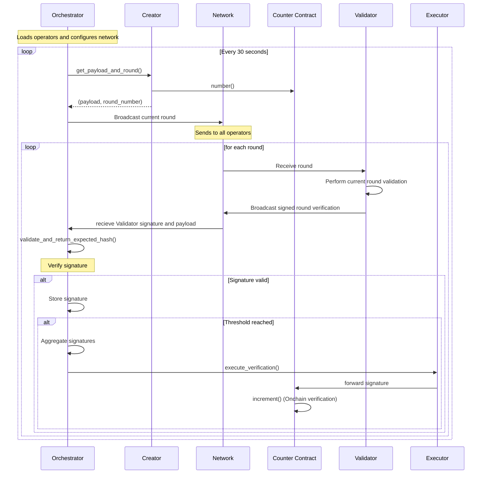

# Counter Usecase

A simple counter implementation that demonstrates BLS signature aggregation for onchain verification.

## Overview

The counter usecase implements a basic counter that increments onchain through BLS signature aggregation. It serves as a proof-of-concept for the AVS router's ability to coordinate multiple validators and execute verified operations on smart contracts.

## Architecture

### Components

- **CounterCreator**: Generates task metadata and payloads for counter operations
- **ListeningCounterCreator**: Listens for external task requests and extracts metadata
- **CounterTaskData**: Type-safe metadata structure for counter operations
- **Counter Contract**: Onchain smart contract that increments a counter

### Sequence Diagram



## Task Data Structure

The counter usecase uses a type-safe `CounterTaskData` structure instead of generic `HashMap<String, String>`:

```rust
pub struct CounterTaskData {
    pub var1: String,
    pub var2: String,
    pub var3: String,
}
```

This provides:
- **Type Safety**: Compile-time validation of metadata structure
- **Serialization**: Binary serialization for efficient wire protocol
- **Default Values**: Consistent fallback behavior

## Usage

### Basic Counter Creator

```rust
let creator = CounterCreator::new();
let metadata = creator.get_task_metadata();
let (payload, round) = creator.get_payload_and_round().await?;
```

### Listening Counter Creator

```rust
let creator = ListeningCounterCreator::new();
// Creator listens for external task requests
// and extracts metadata from TaskRequest.body.metadata
```

## Testing

The counter usecase includes comprehensive tests:

- Unit tests for creator implementations
- Integration tests with mock components
- E2E tests with local blockchain environment

Run tests with:
```bash
cargo test --lib
```

## Configuration

The counter usecase requires:
- Validator threshold configuration
- G1 public key mapping for BLS operations
- Counter contract deployment information

See the main project [README](../../../README.md) for detailed configuration instructions.
